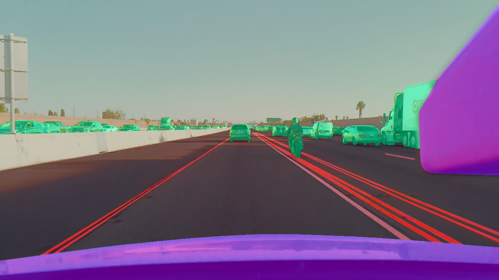

# Masking

Run <pre>./viewer.py</pre> to see them with segnet overlay.

## Directories

<pre>
 images/  -- PNG image files
 masks/   -- PNG segmentation masks
 o/p/     -- The outputs in probability from our internal segnet
</pre>

## Categories

<pre>
 1 - #402020 - road
 2 - #ff0000 - lane markings
 3 - #808060 - un drivable
 4 - #00ff66 - movable
 5 - #cc00ff - my car
</pre>
